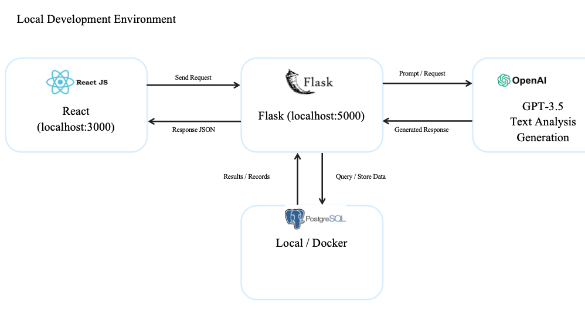
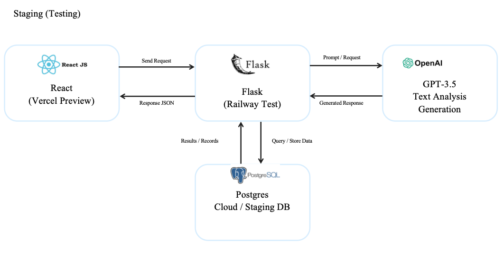
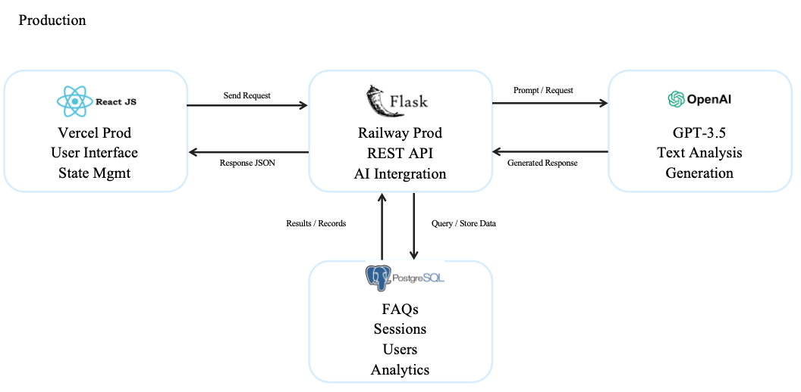

# FAQ Intelligent Q&A System Architecture

The architecture of the FAQ Intelligent Q&A System is organized across three environments—Local, Staging, and Production—to ensure smooth development, testing, and deployment workflows.

## 5.1 Local Development Environment

The development environment runs entirely on localhost to facilitate rapid development and debugging:

### Infrastructure Components
- **Frontend**: React SPA running on `localhost:3000` with React Router for navigation
- **Backend**: Flask API server on `localhost:5000` with session-based authentication
- **Database**: PostgreSQL instance (either local installation or Docker container)
- **AI Services**: Local development configuration for OpenAI API integration

### Communication Flow
- React frontend sends HTTP requests to Flask backend via REST APIs
- Flask processes requests and queries PostgreSQL for FAQ data, user sessions, and logs
- Flask integrates with AI service module for intelligent question processing
- Session management handles user authentication and conversation tracking

### Primary Use Cases
- Feature development and debugging
- Unit testing of individual components
- Database schema development and migration testing

### Architecture Diagram

## 5.2 Staging Environment

The staging setup mirrors production but uses separate resources for testing. The frontend is deployed on Vercel Preview, the backend runs on Railway Test, and the database is hosted on a Postgres Staging DB. This environment supports integration testing and ensures system stability before production release.

### Infrastructure Components
- **Frontend**: Vercel Preview deployment
- **Backend**: Railway Test environment
- **Database**: PostgreSQL Staging instance

### Communication Flow
- End-to-end API testing between deployed frontend and backend
- Database integration testing with production-like data volumes
- AI service integration validation with rate limiting
- Session persistence testing across application restarts

### Primary Use Cases
- Integration testing before production deployment
- User acceptance testing (UAT)
- Performance testing under controlled load
- Validation of deployment scripts and configurations

### Architecture Diagram

## 5.3 Production Environment

The production environment is optimized for scalability, reliability, and security:

### Infrastructure Components
- **Frontend**: React application deployed on Vercel Production with CDN optimization
- **Backend**: Flask service running on Railway Production
- **Database**: PostgreSQL hosted on Railway Database for PostgreSQL (Production tier) with backup and replication
- **AI Integration**: OpenAI GPT API integration with production API keys and usage monitoring

### Additional Services
- Session management with secure cookie configuration
- Conversation tracking and analytics
- Health monitoring and alerting systems

## Communication Flow & Data Processing

### User Interaction Flow
- React frontend sends authenticated API requests to Flask backend
- Flask validates user sessions and processes requests
- Backend returns JSON responses with appropriate status codes

### Intelligent Q&A Processing
- User questions are processed through keyword extraction service
- AI service matches questions against FAQ database using similarity algorithms
- Flask generates intelligent responses via OpenAI API integration
- Conversation sessions are logged for analytics and improvement

### Data Management
- Flask performs CRUD operations on PostgreSQL for FAQs, users, and logs
- Session data is managed for authenticated users
- Analytics data is collected for admin dashboard insights

### External API Integration
- Flask sends structured prompts to OpenAI GPT API for response generation
- API responses are processed and formatted before returning to users
- Rate limiting and error handling ensure service reliability

### Architecture Diagram
